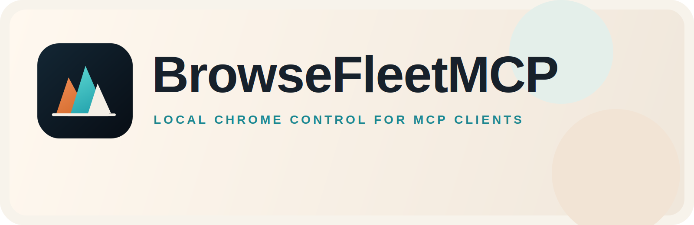

# BrowseFleetMCP

<p align="center">
  
</p>

BrowseFleetMCP is a local MCP server plus a Chrome extension for driving your real, already-logged-in browser without collapsing everything into one shared tab.

It was built for agent workflows where multiple clients need separate browser sessions, real screenshots, and a browser side that stays alive instead of silently dying in the background. It was inspired by BrowserMCP, but the focus here is multi-session control, local reliability, and making the moving parts inspectable.

Docs: https://jakubjdolezal.github.io/browsefleetmcp/

## What This Repo Contains

- The stdio MCP server in the repo root
- The Chrome extension in [`extension-v2/`](./extension-v2)
- Copy-ready client configs in [`examples/`](./examples)
- The public setup site in [`docs/`](./docs)

Important: the npm package gives you the server, not the extension bundle. You still need a checkout of this repo so Chrome can load [`extension-v2/`](./extension-v2) as an unpacked extension.

## Why It Exists

- It uses your existing Chrome profile, so websites behave like your normal browser instead of a fresh automation sandbox.
- It can keep multiple connected sessions alive at once, with one leased session per MCP client.
- It isolates connected tabs into separate windows so agents do not step on each other.
- It exposes both a simplified DOM snapshot view and real rendered screenshots.
- It stays local. The extension talks to a helper on `127.0.0.1`, not to BrowseFleet-operated servers.

## How It Works

The MCP server runs as a local stdio process. The extension connects tabs to the local broker over WebSocket. Once a tab is connected, MCP tools such as `browser_snapshot`, `browser_click`, `browser_type`, and `browser_screenshot` operate on the currently selected session.

Session management is explicit:

- `browser_list_sessions` shows the available connected sessions
- `browser_get_current_session` shows what this client currently owns
- `browser_switch_session` moves this client to a different session
- `browser_create_session` or `browsefleetmcp create-session` opens and connects a new isolated tab/window

Focus-sensitive actions such as click, type, drag, hover, and keypresses are serialized behind one global focus lock so two agents do not steal window focus from each other mid-action.

## Quick Start

### 1. Build and load the extension

```bash
git clone https://github.com/JakubJDolezal/browsefleetmcp.git
cd browsefleetmcp/extension-v2
npm install
npm run build
```

Then open `chrome://extensions`, enable Developer mode, choose `Load unpacked`, and select [`extension-v2/`](./extension-v2).

### 2. Run the server

Published package:

```bash
npx -y browsefleetmcp
```

Current checkout:

```bash
cd /absolute/path/to/browsefleetmcp
npm install
npm run build
node dist/index.js
```

The default browser ports are `9150`, `9152`, and `9154`.

If you want a shared local auth token:

```bash
browsefleetmcp --auth-token your-shared-token
```

The extension popup exposes matching port and auth-token settings.

### 3. Point your MCP client at it

The generic stdio shape is:

```json
{
  "command": "npx",
  "args": ["-y", "browsefleetmcp"]
}
```

Or for the local checkout:

```json
{
  "command": "node",
  "args": ["/absolute/path/to/browsefleetmcp/dist/index.js"]
}
```

Specific client configs live in [`examples/`](./examples), and the full setup docs are at https://jakubjdolezal.github.io/browsefleetmcp/clients.html

### 4. Connect a tab or create one

You have two ways to get a usable browser session:

- Open a tab in Chrome and connect it from the extension popup
- Ask the system to create one for you with `browser_create_session` or `browsefleetmcp create-session --url <url>`

If the extension is loaded but no session is connected yet, browser tools will fail with `No connected tab`.

## Direct CLI

The package is also a direct operational CLI. Useful commands:

```bash
browsefleetmcp --help
browsefleetmcp health
browsefleetmcp create-session --url https://example.com --label "Docs Search"
browsefleetmcp destroy-session --session-id <session-id>
browsefleetmcp reload-extension
browsefleetmcp restart-transport
```

`health` shows the broker state, extension connection, and current session pool. `reload-extension` is the fast path after rebuilding [`extension-v2/`](./extension-v2). `restart-transport` restarts the local broker and socket stack without telling your MCP client to reconnect manually.

## Repo Layout

- [`src/`](./src) is the server, broker, session pool, and tool surface
- [`extension-v2/`](./extension-v2) is the Chrome extension runtime
- [`tests/`](./tests) covers broker/session behavior and CLI/MCP integration
- [`examples/`](./examples) contains ready-to-copy configs
- [`docs/`](./docs) contains the GitHub Pages site

## Development

Build the server:

```bash
npm install
npm run build
```

Build the extension:

```bash
cd extension-v2
npm install
npm run build
```

Run the main test suites:

```bash
npm test
cd extension-v2 && npm test
```

## Troubleshooting

- `No connected tab`: the extension is running, but nothing is attached yet.
- Browser tools stop working after local changes: rebuild the extension and run `browsefleetmcp reload-extension`.
- Your client is still using an older server build: point it at `node /absolute/path/to/browsefleetmcp/dist/index.js` instead of `npx -y browsefleetmcp`.
- Chrome Web Store pages are intentionally not connectable.
